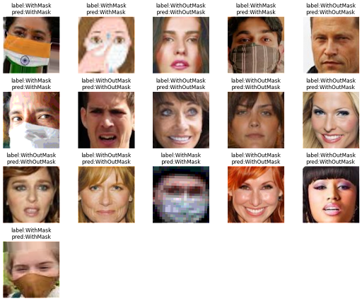

# External Essay
This is reperiostry is official implementation of ~~
## To what extent does the attention mechanism affect the performance of a convolutional neural network when applied to face mask detection?	

1. How to train (reproduce)
```python
python train.py
```
<!-- 2. How to Test (evaluation)
```python
python test.py
``` -->

<!--  -->
You can find the dataset I used in this website:
[Kaggle](https://www.kaggle.com/datasets/ashishjangra27/face-mask-12k-images-dataset)